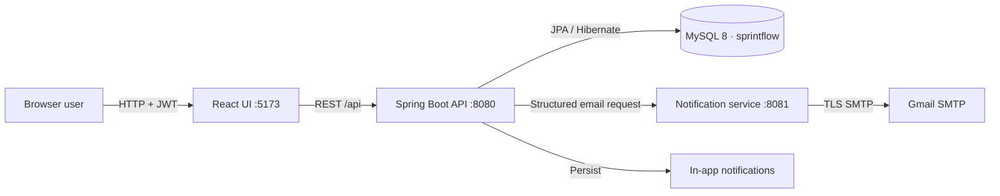
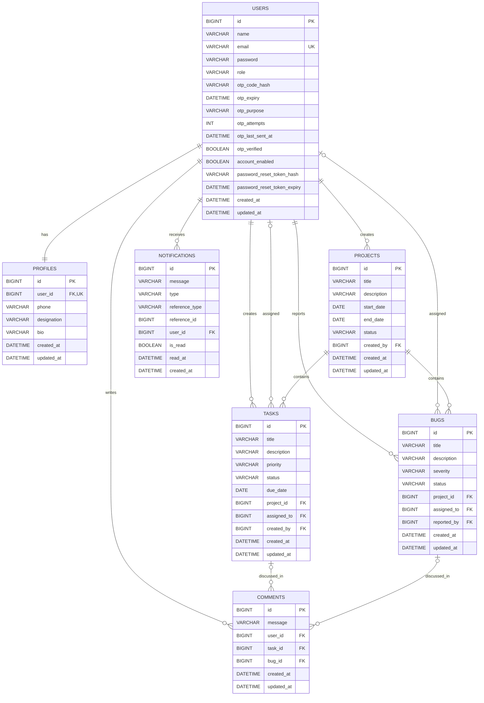

# SprintFlow local setup and viva guide

This guide describes the implementation that is present in this folder. The project contains three independently runnable applications:

```text
SprintFlow/
├── sprintflow-api/                  Spring Boot main application, port 8080
├── sprintflow-notification-service/ Spring Boot Gmail sender, port 8081
├── sprintflow-ui/                   React and Vite application, port 5173
└── START_HERE.md
```

## 1. Architecture

The browser communicates only with `sprintflow-api`. The main API owns authentication, authorisation, MySQL data, business rules, dashboards, and in-app notifications. It sends a structured REST request to the notification service when an email is useful. The notification service owns Gmail SMTP and HTML email rendering.



Email delivery is deliberately outside the main database transaction. `NotificationClient` catches connection, timeout, and non-success response failures. A project, task, bug, registration, or comment operation therefore remains valid when Gmail is temporarily unavailable.

### Final data-model decisions

- OTP values are stored as BCrypt hashes in `otp_code_hash`, not as readable codes.
- A short-lived BCrypt-hashed password reset token is issued only after the reset OTP is verified. This separates OTP verification from the final password change.
- `AuditableEntity` centralises immutable `createdAt` and maintained `updatedAt` timestamps for entities that need both.
- Task due dates and project end dates are nullable because early planning may not have a final date.
- Profiles use initials generated by the UI/API instead of file upload.
- A database check constraint and service-layer construction enforce that a comment belongs to exactly one task or one bug.
- Deleting a project that has work and deleting a task/bug that has comments is rejected. Archiving retains an auditable history.
- All controlled values are string enums. No ordinal enum values are stored.
- JPA relationships point from the child to the required parent. Parent entities do not contain back-reference collections, which avoids recursive JSON and oversized entity graphs.
- REST controllers return DTOs only; JPA entities are never returned directly.

### Entity relationship diagram



## 2. Authentication, notification, and seed flows

Registration normalises the email, validates password strength, prevents duplicates, hashes the password, creates a disabled `MEMBER`, creates the profile, creates a six-digit OTP, stores only its BCrypt hash, and asks the notification service to email the raw code. Verification checks purpose, expiry, attempt count, and hash before enabling the account. Resends have a 60-second cooldown. Codes expire after 10 minutes and are invalidated after success.

Login first checks that the account is verified and enabled, delegates password authentication to Spring Security, and returns an eight-hour signed JWT containing only user identity and role claims. `JwtAuthenticationFilter` validates the bearer token for private requests. The UI attaches it through one Axios interceptor and clears the local session on `401`.

Forgot-password always returns a generic response. A known active account receives a reset OTP. Successful OTP verification creates a one-use, ten-minute reset token. The final endpoint verifies that token, BCrypt-hashes the new password, and clears the token.

`AdminSeeder` looks up `pranavdeulkar04@gmail.com` every time the application starts. It inserts the administrator only when absent and creates a profile only when absent. The account is already enabled and verified, receives no OTP, and cannot be demoted or deactivated through normal administration.

Assignment, reassignment, status, due-date, severity, project-status, and comment events create in-app notifications for affected users. Assignment/reassignment and meaningful work/project updates also request email delivery. Actions do not notify their actor.

## 3. Roles and permissions

| Capability | ADMIN | MANAGER | MEMBER |
|---|---:|---:|---:|
| View application projects | Yes | Yes | Assigned/relevant only |
| Create/update/archive projects | Yes | Yes | No |
| Create/fully edit/assign tasks and bugs | Yes | Yes | No |
| View tasks and bugs | All | All | Assigned work only |
| Update task or bug status | Yes | Yes | Own assigned work |
| Add comments | Yes | Yes | Accessible work |
| Manage user roles and account status | Yes | No | No |
| Edit own profile/password | Yes | Yes | Yes |
| Read/manage own notifications | Yes | Yes | Yes |

These checks are enforced by Spring Security and service-level ownership rules. The React role-aware navigation is only a convenience, not the security boundary.

### Source structure

```text
sprintflow-api/
├── pom.xml
└── src/
    ├── main/
    │   ├── java/com/sprintflow/
    │   │   ├── auth/            controllers, DTOs, OTP/login/reset service, JWT security
    │   │   ├── user/            user/profile entities, repository, service, endpoints
    │   │   ├── project/         project model, filters, rules, endpoints
    │   │   ├── task/            task model, assignment rules, endpoints
    │   │   ├── bug/             bug model, assignment rules, endpoints
    │   │   ├── comment/         exactly-one-parent comments
    │   │   ├── notification/    in-app notification history and actions
    │   │   ├── dashboard/       live personal statistics
    │   │   ├── integration/     resilient notification-service client
    │   │   ├── common/          auditing, page response, exception handling
    │   │   └── config/          security, OpenAPI, administrator seeding
    │   └── resources/application.properties
    └── test/                     unit and Spring security/integration tests

sprintflow-notification-service/
├── pom.xml
└── src/
    ├── main/
    │   ├── java/com/sprintflow/notification/
    │   │   ├── controller/      structured email REST endpoint
    │   │   ├── dto/             request, response, and notification types
    │   │   ├── service/         Gmail sender and escaped HTML templates
    │   │   └── exception/       validation error responses
    │   └── resources/           base, ignored local, and safe example configuration
    └── test/                     request validation and SMTP-failure tests

sprintflow-ui/
├── package.json
├── vite.config.js
├── index.html
└── src/
    ├── api/                      single Axios client and domain services
    ├── context/                  authentication state
    ├── components/               shell, route guard, reusable UI states
    ├── pages/                    all authentication and product screens
    ├── styles/app.css            responsive design system
    ├── App.jsx                   complete route map
    └── main.jsx                  React entry point
```

## 4. Requirements on Windows

Install:

- JDK 17. Java 21 also runs this project because Maven compiles it to Java 17 bytecode.
- Maven 3.9 or later.
- Node.js 20 LTS or later with npm.
- MySQL Server 8.x.

Check from PowerShell or Command Prompt:

```powershell
java -version
mvn -version
node --version
npm --version
mysql --version
```

The expected local values are:

```text
Database: sprintflow
MySQL host and port: localhost:3306
MySQL username: root
MySQL password: Hello@123
```

The URL uses `createDatabaseIfNotExist=true`, so the API creates the database when the MySQL account has permission.

## 5. Run SprintFlow

Start applications in this order:

1. MySQL
2. Notification service
3. Main API
4. React UI

Open four PowerShell windows.

### Window 1: verify MySQL

```powershell
Get-Service MySQL80
Start-Service MySQL80
mysql -u root -p
```

Enter the MySQL password when prompted. In MySQL:

```sql
SELECT VERSION();
EXIT;
```

If the service has a different name, find it with:

```powershell
Get-Service *mysql*
```

### Window 2: notification service

```powershell
Set-Location "C:\path\to\SprintFlow\sprintflow-notification-service"
mvn spring-boot:run
```

Wait for `Tomcat started on port 8081`. Health: `http://localhost:8081/actuator/health`.

The default `local` profile loads the ignored file:

```text
sprintflow-notification-service/src/main/resources/application-local.properties
```

The supplied ZIP contains the ready local file. The safe `.example` file does not contain the real app password.

### Window 3: main API

```powershell
Set-Location "C:\path\to\SprintFlow\sprintflow-api"
mvn spring-boot:run
```

Wait for `Tomcat started on port 8080`. The first successful start creates/updates the schema and seeds the administrator.

### Window 4: React UI

```powershell
Set-Location "C:\path\to\SprintFlow\sprintflow-ui"
npm install
npm run dev
```

Open:

- Product: `http://localhost:5173`
- Swagger UI: `http://localhost:8080/swagger-ui.html`
- Main API health: `http://localhost:8080/actuator/health`
- Notification health: `http://localhost:8081/actuator/health`

Equivalent Command Prompt navigation:

```bat
cd /d "C:\path\to\SprintFlow\sprintflow-notification-service"
mvn spring-boot:run
```

Use the same `cd /d` form for the API and UI folders.

### Administrator login

```text
Email: pranavdeulkar04@gmail.com
Password: Hello@123
```

The password is BCrypt-hashed before it is stored. It is intentionally not shown in the normal product interface.

## 6. Demonstration checklist

### Registration and OTP

1. Open `http://localhost:5173/register`.
2. Register with a real email that is different from the administrator email.
3. Read the six-digit email code.
4. Enter it on the verification screen.
5. Sign in and confirm the dashboard loads.
6. To demonstrate resend, register another address or wait 60 seconds before requesting a new code.

### Forgot password

1. Sign out and choose **Forgot password?**
2. Enter a registered email.
3. Enter the emailed reset code.
4. Choose a strong new password.
5. Confirm that the same reset session cannot be reused and that the new password signs in.

### Task assignment email

1. Sign in as administrator.
2. Create a project.
3. Create a task and select a verified, enabled user.
4. Confirm that the assignee sees an in-app notification and receives an email.
5. Reassign the task and confirm both notification behavior and email.
6. Sign in as the assignee, update the permitted status, and add a comment.

### Bug assignment email

Repeat the task flow from the project’s **Bugs** panel. Choose a severity, assign a user, update status, and add a comment.

## 7. REST endpoint reference

Public authentication:

| Method | Path | Purpose |
|---|---|---|
| POST | `/api/auth/register` | Register and email verification OTP |
| POST | `/api/auth/verify-email` | Verify registration OTP |
| POST | `/api/auth/resend-verification-otp` | Resend with cooldown |
| POST | `/api/auth/login` | Issue JWT |
| POST | `/api/auth/forgot-password` | Send generic reset response and OTP when applicable |
| POST | `/api/auth/verify-reset-otp` | Exchange correct OTP for short-lived reset token |
| POST | `/api/auth/reset-password` | Set a new password with reset token |

Authenticated account and users:

| Method | Path | Access |
|---|---|---|
| POST | `/api/auth/change-password` | Current user |
| GET/PUT | `/api/users/me/profile` | Current user |
| GET | `/api/users/assignable` | Authenticated users |
| GET | `/api/users` | ADMIN |
| PATCH | `/api/users/{id}/role` | ADMIN |
| PATCH | `/api/users/{id}/status` | ADMIN |

Projects:

| Method | Path | Access |
|---|---|---|
| GET | `/api/projects` | Role-filtered list; search/status/sort/page |
| GET | `/api/projects/{id}` | Relevant users |
| POST | `/api/projects` | ADMIN, MANAGER |
| PUT | `/api/projects/{id}` | ADMIN, MANAGER |
| DELETE | `/api/projects/{id}` | ADMIN, MANAGER; empty projects only |

Tasks:

| Method | Path | Access |
|---|---|---|
| GET | `/api/tasks` | Role-filtered list; project/assignee/status/priority/search/sort/page |
| GET | `/api/tasks/{id}` | Relevant users |
| POST | `/api/tasks` | ADMIN, MANAGER |
| PUT | `/api/tasks/{id}` | ADMIN, MANAGER |
| PATCH | `/api/tasks/{id}/status` | ADMIN, MANAGER, assigned MEMBER |
| DELETE | `/api/tasks/{id}` | ADMIN, MANAGER; no comments |

Bugs:

| Method | Path | Access |
|---|---|---|
| GET | `/api/bugs` | Role-filtered list; project/assignee/status/severity/search/sort/page |
| GET | `/api/bugs/{id}` | Relevant users |
| POST | `/api/bugs` | ADMIN, MANAGER |
| PUT | `/api/bugs/{id}` | ADMIN, MANAGER |
| PATCH | `/api/bugs/{id}/status` | ADMIN, MANAGER, assigned MEMBER |
| DELETE | `/api/bugs/{id}` | ADMIN, MANAGER; no comments |

Comments, notifications, and dashboard:

| Method | Path | Purpose |
|---|---|---|
| GET/POST | `/api/tasks/{taskId}/comments` | List/add task comments |
| GET/POST | `/api/bugs/{bugId}/comments` | List/add bug comments |
| DELETE | `/api/comments/{id}` | Author or ADMIN |
| GET | `/api/notifications` | Paginated current-user history |
| GET | `/api/notifications/unread-count` | Current-user unread count |
| PATCH | `/api/notifications/{id}/read` | Mark one as read |
| PATCH | `/api/notifications/read-all` | Mark all as read |
| DELETE | `/api/notifications/{id}` | Delete own notification |
| GET | `/api/dashboard` | Real current-user statistics |

The notification service accepts `POST /api/emails` from the main API and exposes `/actuator/health`.

## 8. Major files to explain in a viva

- `SprintFlowApiApplication.java`: application entry point; enables JPA auditing.
- `SecurityConfig.java`: stateless security, CORS, public routes, BCrypt, and method security.
- `JwtService.java` / `JwtAuthenticationFilter.java`: sign, parse, validate, and apply JWT identity.
- `AuthService.java`: registration, OTP rules, login, forgot/reset, and change password.
- `AdminSeeder.java`: idempotent verified-administrator and profile creation.
- Feature service classes (`ProjectService`, `TaskService`, `BugService`, `CommentService`): transactions, permissions, validation, mapping, and event decisions.
- Entity classes: table constraints and unidirectional relationships.
- Repository classes: pagination, filters, counts, and member-relevant queries.
- `NotificationService.java`: current-user history plus in-app event creation.
- `NotificationClient.java`: five-second timeouts and failure isolation for the mail service.
- `EmailTemplateFactory.java`: safe HTML escaping and type-specific email content.
- `client.js`: the only Axios instance; JWT and central `401`/`403` handling.
- `AuthContext.jsx`: browser session identity and role helpers.
- `App.jsx`: protected routes and role-restricted route groups.
- `WorkItemPages.jsx`: reusable but concrete task/bug list, form, detail, status, and comment screens.
- `app.css`: shared responsive design system and mobile navigation.

When explaining package-by-feature, point out that each feature keeps its entity, DTO, repository, service, and controller near each other. Cross-cutting security, exceptions, auditing, and integration code are kept in dedicated packages.

## 9. Configuration and credential rotation

To replace the Gmail App Password:

1. Create a replacement app password in the sender Google account.
2. Stop the notification service.
3. Open the ignored `sprintflow-notification-service/src/main/resources/application-local.properties`.
4. Replace only the `spring.mail.password` value. Remove spaces Google adds for display.
5. Restart the notification service and repeat an OTP test.
6. Revoke the old app password in the Google account.

Never copy the real value to `application.properties`, the `.example` file, Java source, the React app, Swagger, logs, or Git. The root and service `.gitignore` files exclude the local file.

The API supports environment overrides:

```powershell
$env:SPRINTFLOW_DB_USERNAME = "root"
$env:SPRINTFLOW_DB_PASSWORD = "a-new-local-password"
$env:SPRINTFLOW_JWT_SECRET = "a-base64-encoded-secret-of-at-least-32-bytes"
mvn spring-boot:run
```

Close that PowerShell window or remove the environment variables when finished.

## 10. Troubleshooting

**MySQL service is stopped**

```powershell
Get-Service *mysql*
Start-Service MySQL80
```

**Access denied for MySQL user**

Check the username/password in `sprintflow-api/src/main/resources/application.properties`. Test interactively with `mysql -u root -p`. Update the environment override if the local password changed.

**Unknown database**

The API creates `sprintflow` only when `root` has create permission. Create it manually if necessary:

```sql
CREATE DATABASE sprintflow CHARACTER SET utf8mb4 COLLATE utf8mb4_unicode_ci;
```

**Port already in use**

```powershell
Get-NetTCPConnection -State Listen -LocalPort 8080,8081,5173
Get-Process -Id <OwningProcess>
```

Stop only the known conflicting application, or change the port consistently in the matching configuration.

**CORS error**

Run the UI on `http://localhost:5173`, not an arbitrary port. Confirm the API is on 8080 and `.env` contains `VITE_API_BASE_URL=http://localhost:8080/api`. Restart Vite after changing `.env`.

**Invalid or expired JWT**

Sign out and sign in again. JWTs expire after eight hours. Confirm the API JWT secret did not change during the session.

**Notification service unavailable**

Open `http://localhost:8081/actuator/health`. Start it before the API. Main work is still saved; only the email attempt is missed.

**Gmail authentication failed / invalid App Password**

Confirm two-step verification is enabled, use an App Password rather than the normal Gmail password, remove display spaces, rotate it as described above, and restart the notification service.

**Email timeout**

Check internet connectivity, firewall access to `smtp.gmail.com:587`, and system date/time. Both SMTP and API-to-mail-service connections have five-second timeouts.

**Frontend dependency error**

```powershell
Set-Location "C:\path\to\SprintFlow\sprintflow-ui"
npm install
npm run build
```

Do not copy a `node_modules` directory from a different computer.

**Build with a clean cache**

```powershell
mvn clean test
npm run build
```

## 11. Verification commands

```powershell
Set-Location "C:\path\to\SprintFlow\sprintflow-api"
mvn clean package

Set-Location "C:\path\to\SprintFlow\sprintflow-notification-service"
mvn clean package

Set-Location "C:\path\to\SprintFlow\sprintflow-ui"
npm install
npm run build
```

Generated build folders (`target`, `dist`, and `node_modules`) are deliberately excluded from the clean source ZIP because each is reproducible with these commands.
